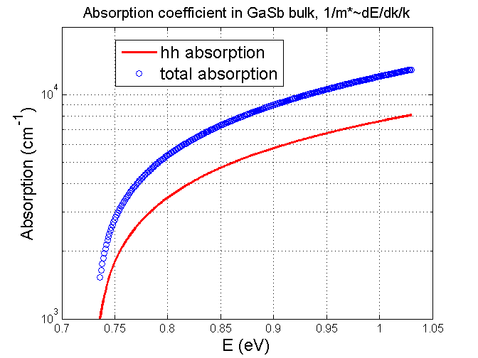

# absorption_coefficient
calculate absorption coefficient of semiconductor materials by Fermi's Golden rule.
# Knowledge background
The absorption coefficient can bes expressed as:

where the momentum matrix element for bulk material is:

 Detailed derivation can be found in "absorption coefficient formula, momentum matrix element.docx".

The density of states for bulk material is:

Away from band edge,  the energy dispersion relation E(k) is no more parabolic, which means the effective mass is not constant. The E(k) relation can be calculated by using envelop-function approximation. Depending on the number of bands that are treated as basis functions, different multi-band models are developed.  The detailed formula derivation is in "nonparabolicity in  band structure.docx", where both 2-band model and 8-band models can have analytical expression for the nonparabolicity of energy dispersion.

After the analytical energy dispersion is obtained, the effective mass is evaluated by taking the derivative. Usually, the second derivative is used. However, here the first derivative is used and is referred as **optical mass**. I still don't have clear understanding for such practice. I only know the second derivative will produce a inflating result.  The detailed calculation can be found in "calculate absorption coefficient,GaInAsSb.docx", which was originally developed to target at quaternary material GaInAsSb.
# Matlab codes and example result
Two code files are provided to calculate the absorption coefficient by 2-band model and 8-band model, respectively. Note that the optical mass first appeared in Peter Yu's book, fundamentals of semiconductor.

A result obtained by 8-band model is like:

The codes can be easily modified to calculate other binary semiconductor material.  Due to the time strain, these codes are only functional without further optimization.

Equations written in MathJax are not supported by Github Flavored Markdown:

[eq 1]: $ \alpha(\hslash\omega)=\frac{\pi q_e^2\hslash}{n_bm_0^2c_0\epsilon_0\hslash\omega }\mid\hat{e}\cdot\vec{p}_{cv}\mid^2\rho_r(E_t) $

[eq 2]:  $ \mid\hat{e}\cdot\vec{p}_{cv}\mid^2=\frac{P_x^2}{3}\equiv M_b^2 $

[eq 3]: $ \rho_t[cm^{-3}]=\frac{1}{2\pi^2}(\frac{2m_r}{\hslash^2})^\frac{3}{2}\sqrt{E_t} $
