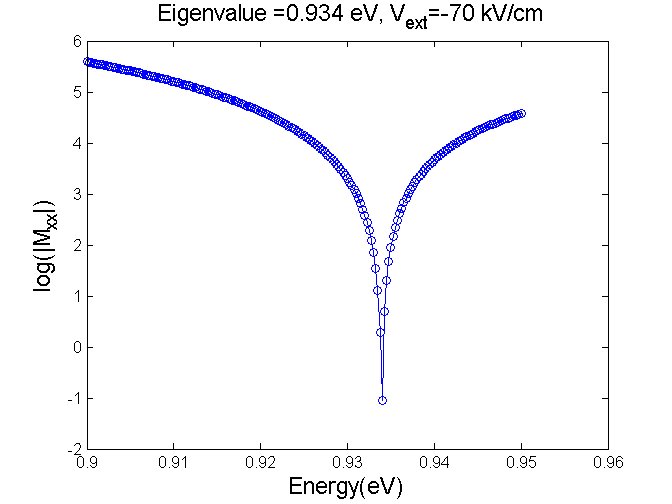
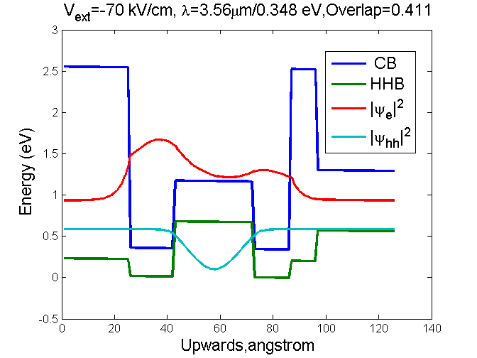
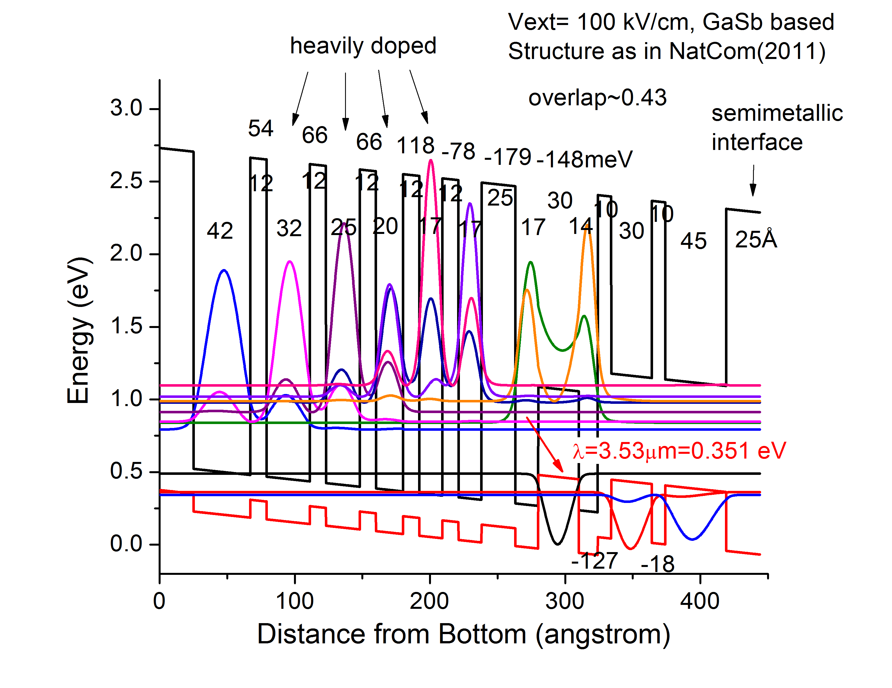

[TOC]

This project is able to calculate electron/hole wavefunction in quantum wells with arbitrary number of layers. The output includes eigen energy and wavefunction overlap.

# Code diagram

The structure of multiple quantum wells is parameterized in a main file. Here,  "Example1.m" is provided as the main file, in which the code diagram is
 as follows:

``` python
main 
  fun_EigenValue_2band_ext 
    fun_refl_2band_ext 
      fun_matrix_next
  fun_field_2band_ext 
    fun_matrix_next
  fun_EigenValue_1band_ext 
    fun_refl_1band_ext 
      fun_matrix_next
  fun_field_1band_ext 
    fun_matrix_next
```

The call functions are defined in separate files with file name beginning with "fun_". These sub-codes should be in the same file folder with the main code.

# Notes on running the code

## Band offset parameters

The band offset parameters are the first step to define a quantum well structure. However, large uncertainty still exists. One factor is, at the atomic scale, the material quality is difficult to control from batch to batch. Another factor is the band offset apprears at the interface of two material, so the value changes with strain effect.

The first issue was addressed by a review paper, [I. Vurgaftman, et al, J. Appl. Phys.(2001)](http://scitation.aip.org/content/aip/journal/jap/89/11/10.1063/1.1368156), which compiled huge amount of data and recommended values for use.

The second issue can be solved by calculating the strain effect. Because interband cascade lasers are based on either GaSb or InAs substrate, at least two sets of band offsets are needed. Function call is not a good idea here due to the requirement of returning too many variables. Instead,  a "band_offset_collection.m" file  is used to explicitly list the data. New data can be calculated by "BandEdgeShift.m". In practice, it's more convenient to keep a spreadsheet, like "band_offset.xlsx".

## Avoid fake results

This program is able to calculate structure with arbitrary number of layers. However, when the number of layers is large, e.g. more than 10, some fake results will appear. Some tricks are in the codes to ticking out these unwanted results.

1.  use "task selection" to calculate electron and hole wavefunction  individually.
2.  use "xr" to avoid the fake results.  The first run should have a large range of xr to scan all the possible solutions. In Figure 1 generated by "fun_EigenValue**.m", the eigen values usually lies in the dips and each dip is for a specific QW at the ground state. Shrink the range for the next run and get more accuracy. 
3.  carefully use "force2zero" to eliminate the theoretically zero region. This absursity  exists because when we choose eigen value, our gauge is the minimum matrix instead of zero. 

# Generated Results

Depending on "task selection", you may obtain 2 or 5 graphs by running the code.

**get eigen value**



**wavefunction profile**



"Example2.m" uses a complete stage of cascade region as input. If each output wavefunction is collected, a synthetic graph can be produced by OriginPro:



# Model limitations

The electron wavefunction is calculated by two-band model while the heavy hole wavefunction is calculated by one-band model. They are sufficient for **quick prototyping**.  From the perspective of machine learning, these simple models are highly bias. They are very powerful to grasp the basic ideas. Decent accuracy can be achieved if the material quality is consistent. Some research may opt for more complex model like eight-band model or even fourteen-band model. However, the accuracy is still not guaranteed, because the interaction between quantum-level particles are much more complicated.

Other limitation of this model is the lack of consideration of carrier transport and Poisson equation. An operating laser will have charged carrier accumulated in the "W" shape active region and possibly in the injection region. All these considerations are vital to the ultimate limit for a laser. 