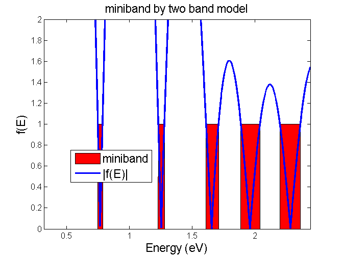
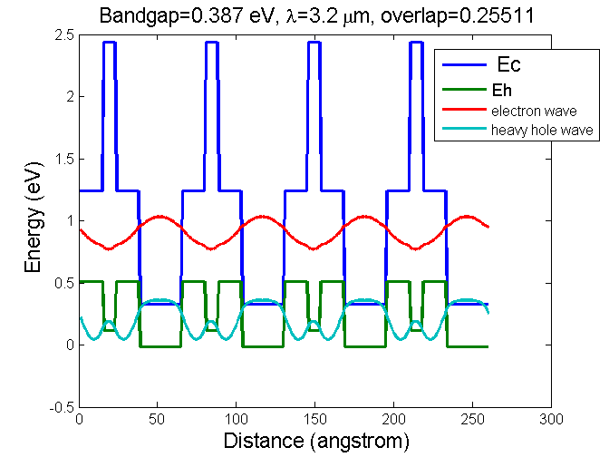

 This project calculates electron/hole wavefunction for superlattice with arbitrary number of layers in one period.

 # Code diagram

The structure of SL is parameterized in a main file. Here, "Example.m" is provided as the main file, in which the code diagram is as follows:

```swift
input parameter
fun_miniband_1band {
  fun_miniband_matrix_1band {
    fun_matrix_next
  }
}
un_miniband_2band {
  fun_miniband_matrix_2band {
    fun_matrix_next
  }
}
fun_miniband_profile
fun_miniband_wavefunction_1band {
  fun_miniband_matrix_1band
  fun_matrix_previous
  fun_matrix_next
}
fun_miniband_wavefunction_2band {
  fun_miniband_matrix_2band
  fun_matrix_previous
  fun_matrix_next
}
output result and plot final graph
```
The recalled functions are defined in separate files with file name beginning with "fun_". These sub-codes should be in the same file folder with the main code.

# Generated Results
Once you run the main file in Matlab, 6 graphs will be generated. Two of them are below:



# Model and limitations
Similar to "**electron_wavefuncton_MQW**" project, the electron wavefunction is calculated by two-band model while the heavy hole wavefunction is calculated by one-band model. They are sufficient for **quick prototyping**. However, more accuracy will require more complex model like eight-band model or even fourteen-band model.

The major difference between "**electron_wavefuncton_MQW**" and "**electron_wavefuncton_SL**" is the boundary condition. The former used "decaying wave" condition; the latter use "Kronig-Penney model" in which the wavefunction is repeated in every period.

The material growth of superlattice is still challenging due to frequent valve changes and possible strain accumulations. To alleviate the latter issue. sub-atom level of interface layer is introduction. This poses extra difficulty for accurate modeling because the band offset of the interface layer is uncertain.
