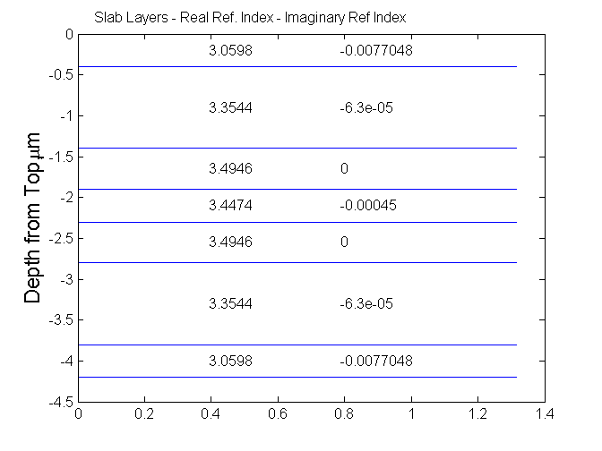
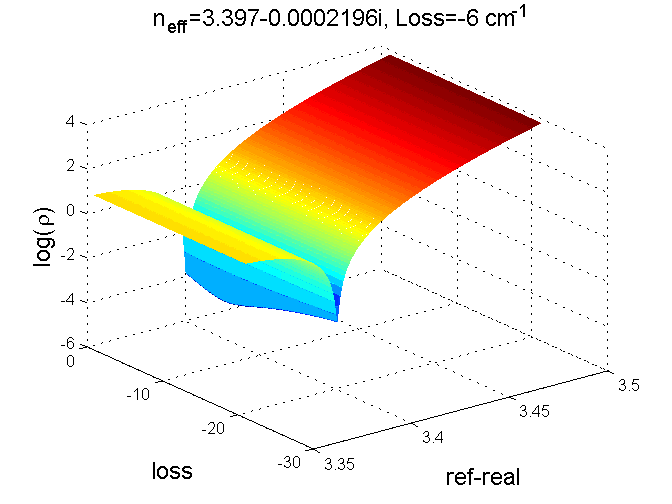
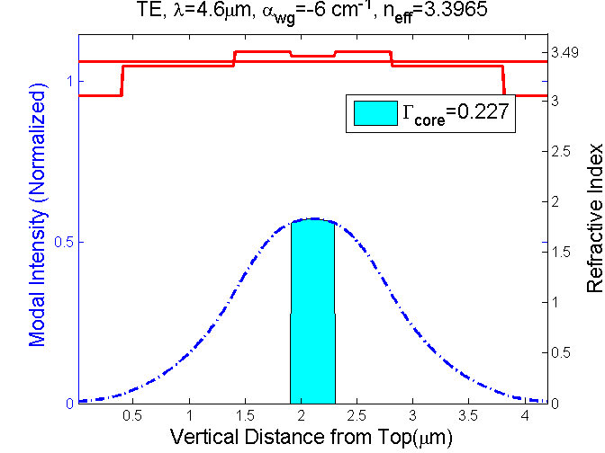
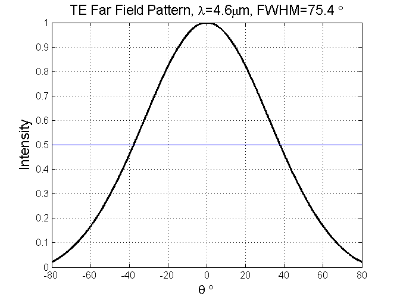
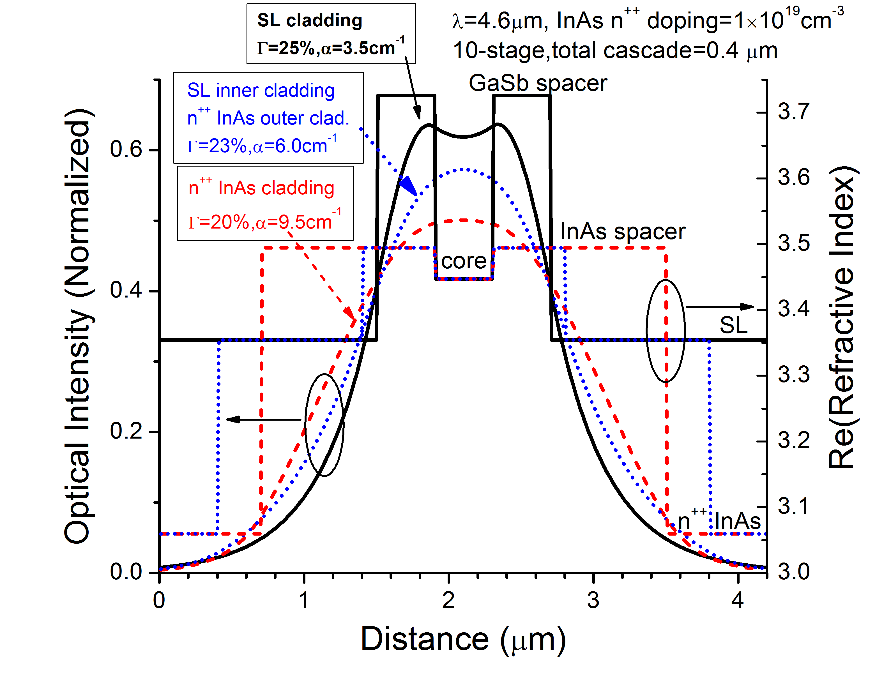
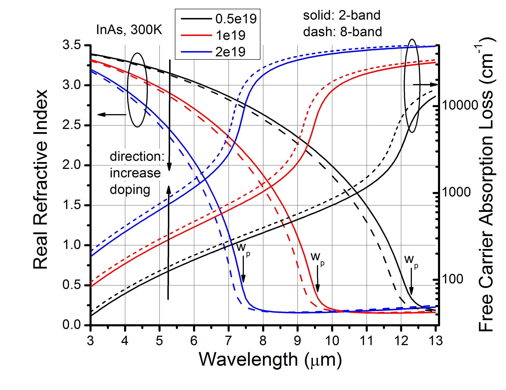

[TOC]

This project was originally developed to calculate waveguide for **InAs-based interband cascade laser**.  But it can be used to calculate any 1-D optical waveguide if  the refractive index of each layer is given.

Since 2015 Sep, I mostly use Python as my programming language. Though I am not sure I have time to convert my Matlab code to Python, I am pretty sure Python is the future.

# Code Structure

The waveguide structure is parameterized in a main file. Here,  "AnExample.m" is provided as the main file, in which the code diagram is as follows:

``` python
main
  fun_index_overview
  fun_getNeff 
    fun_waguide_matrix 
      fun_matrix_next_wg
  fun_opticalField 
    fun_matrix_next_wg
  fun_farField
```

The call functions are defined in separate files with file name beginning with "fun_". These sub-codes should be in the same file folder with the main code.

# Generated graphs

Once the main file is run in Matlab, 4 graphs will be generated:

**index profile**



**get modal index**



**Optical modal profile**



**far-field profile**



# Post-processing

Some lines in the main file are written to output the calculated results for post-processing  and better visualization, e.g., using OriginPro.

## Waveguide comparison

The following graph compares three different waveguides.  It's worth noting that the blue one has been used to obtain the **lowest threshold current density** (~250 A/cm^2)  among mid-infrared semiconductor lasers near 4.6 um. This has been reported as "research highlight" in [Nature Photonics](http://www.nature.com/nphoton/journal/v9/n8/full/nphoton.2015.147.html) in 2015.



## Refractive index of doped InAs

A critical part for waveguide calculation is the accurate evaluation of refractive index for each material. This project provides a function ("fun_nik_InAs.m"), based on "Drude model", to predict the complex refractive index of InAs at different doping levels and different wavelengths.  Following is a synthetic result.


